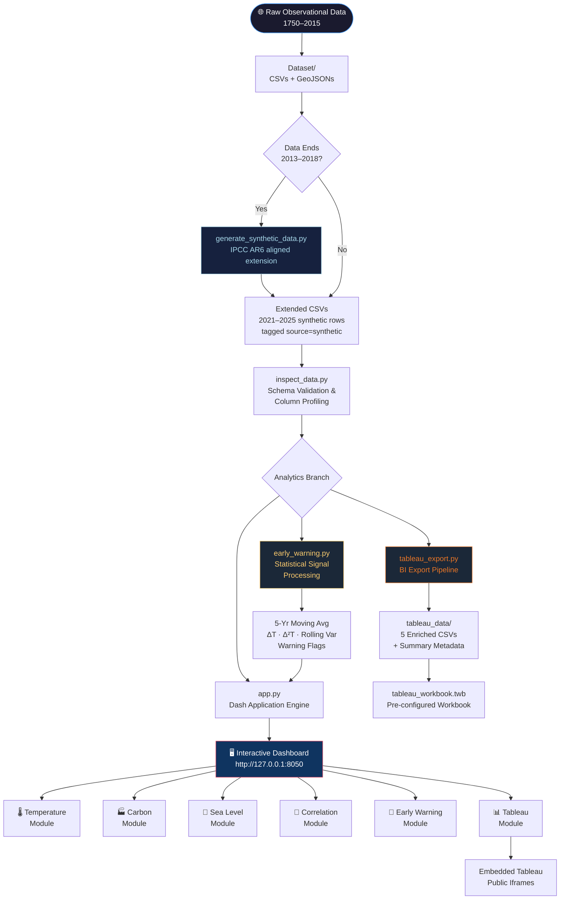
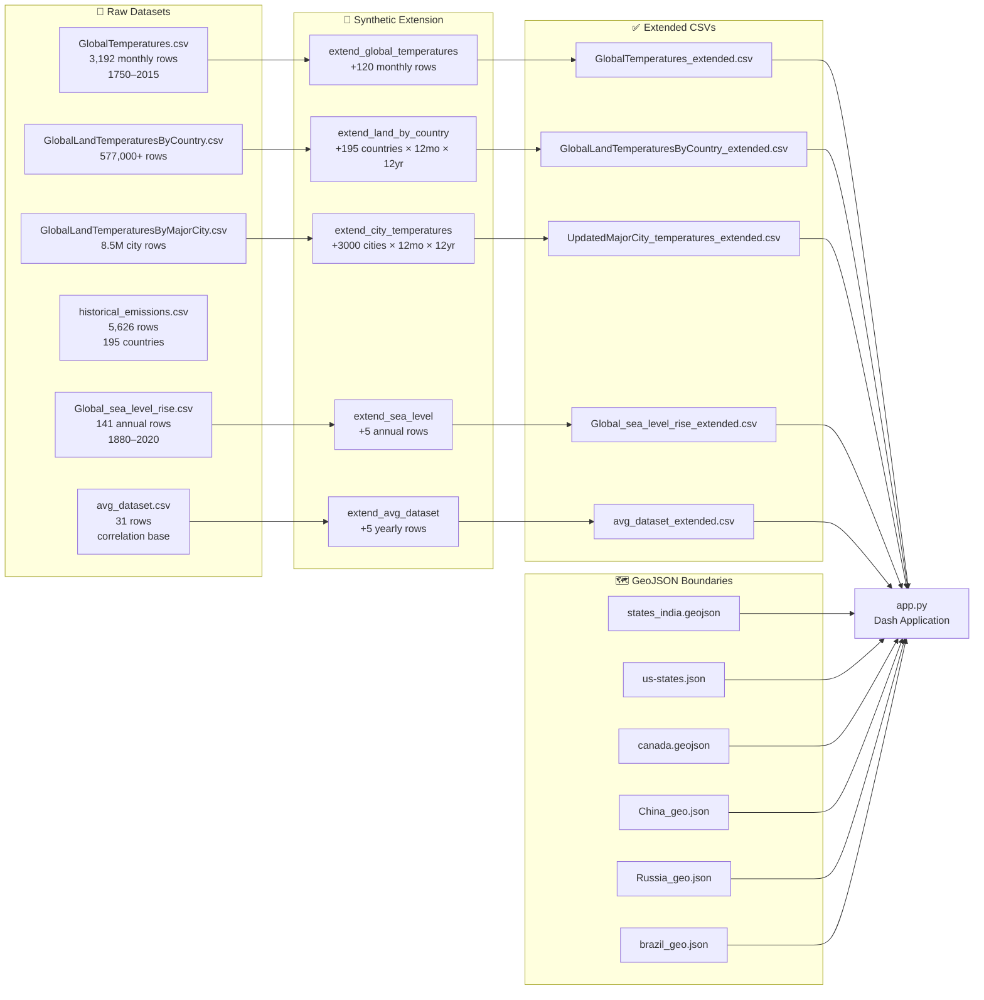
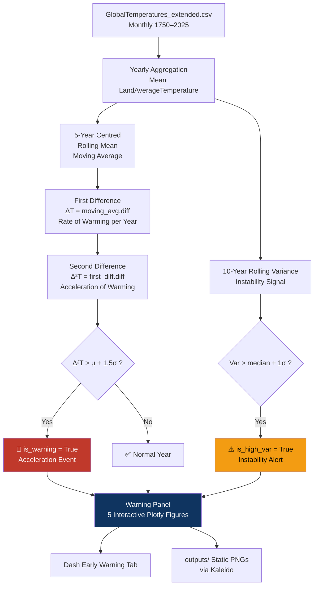
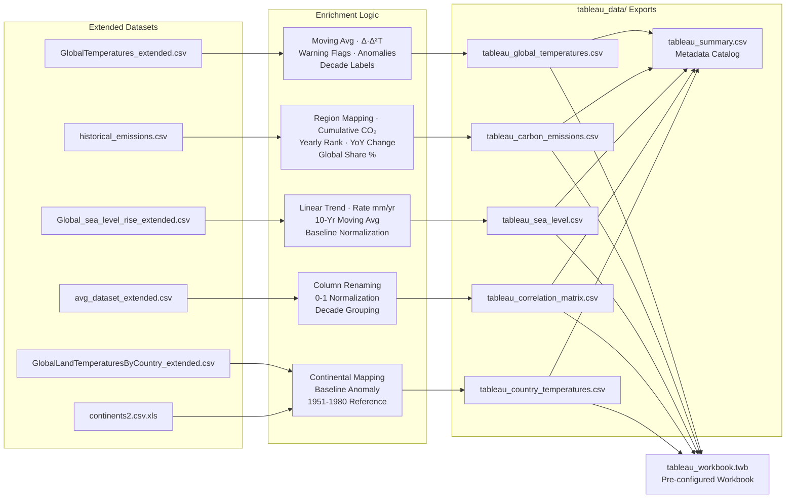
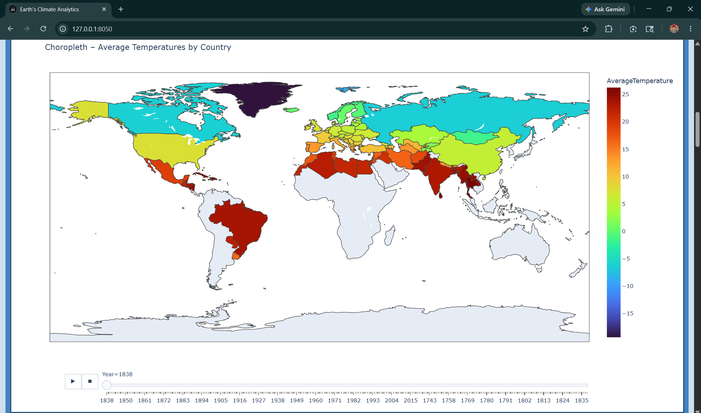
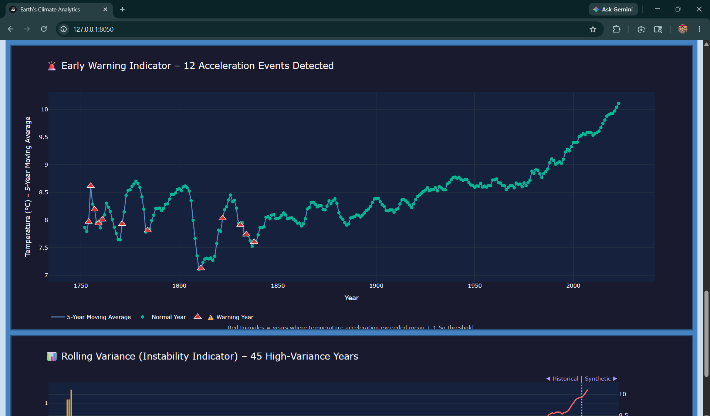
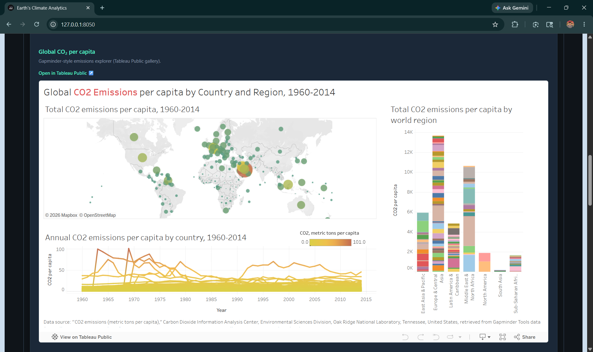
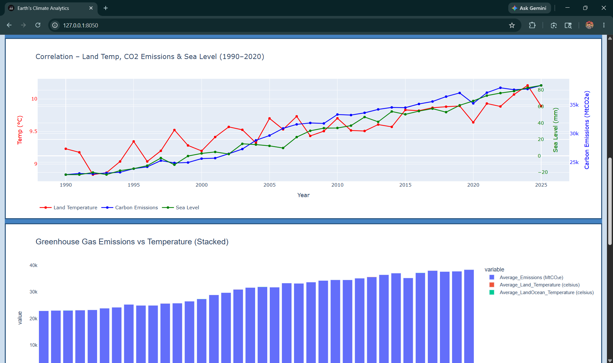
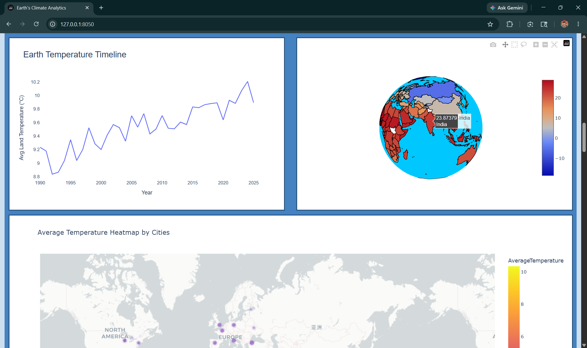
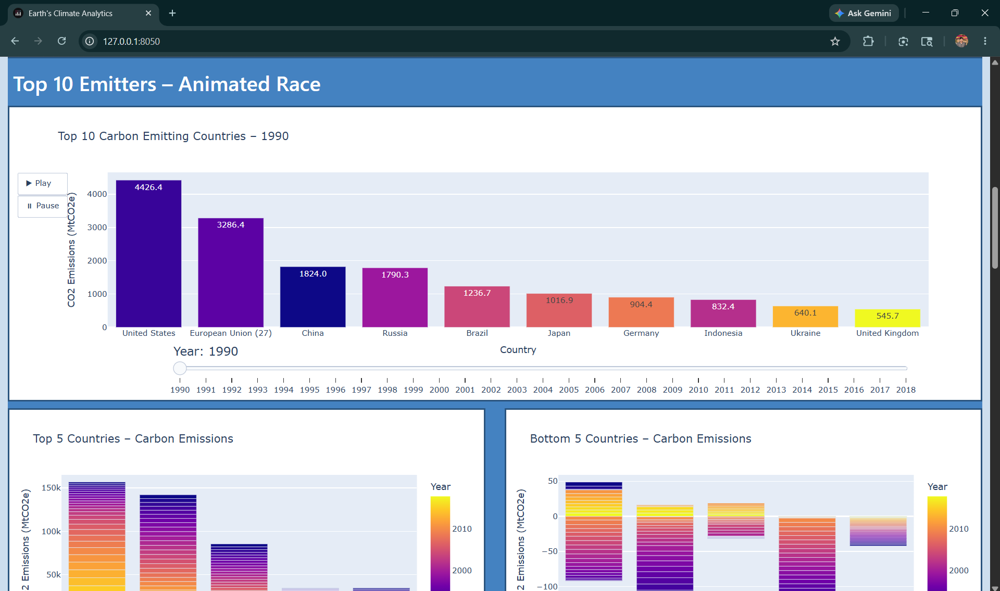

<div align="center">


# 🌍 earthvision-ai
### *EarthVision AI — Visualization & Early Warning System*

**An enterprise-grade, AI-ready interactive analytics platform tracking 275 years of planetary climate signals — Surface Temperature · Carbon Emissions · Sea Level Rise**

---

[](https://python.org)
[](https://dash.plotly.com)
[](https://www.tableau.com)
[](https://pandas.pydata.org)
[](https://numpy.org)
[](LICENSE)
[]()
[]()

---

<table>
<tr>
<td align="center"><strong>🗓️ Time Range</strong><br/>1750 – 2025</td>
<td align="center"><strong>🌐 Countries Covered</strong><br/>195+</td>
<td align="center"><strong>🏙️ Major Cities</strong><br/>3,000+</td>
<td align="center"><strong>📊 Visualization Modules</strong><br/>6</td>
<td align="center"><strong>📁 Datasets</strong><br/>36 Files</td>
<td align="center"><strong>📈 Tableau Exports</strong><br/>5 Enriched CSVs</td>
</tr>
</table>

</div>

---

## 📖 Table of Contents

- [Project Overview](#-project-overview)
- [Key Features](#-key-features)
- [System Architecture](#-system-architecture)
- [Tech Stack](#-tech-stack)
- [Repository Structure](#-repository-structure)
- [Dataset Pipeline](#-dataset-pipeline)
- [Analytics Workflow](#-analytics-workflow)
- [Early Warning System](#-early-warning-system-deep-dive)
- [Tableau Integration](#-tableau-integration)
- [Synthetic Data Engine](#-synthetic-data-engine)
- [Visualization Gallery](#-visualization--dashboard-gallery)
- [Installation & Setup](#-installation--setup)
- [Execution Commands](#-execution-commands)
- [Engineering Challenges](#-engineering-challenges)
- [Future Roadmap](#-future-roadmap)
- [Learning Outcomes](#-learning-outcomes)
- [Author](#-author)

---

## 🎯 Project Overview

**EarthVision AI** is a production-grade climate intelligence platform built to analyze, visualize, and forecast the three defining pillars of modern climate science: **surface temperature**, **carbon dioxide emissions**, and **sea level rise** — spanning 275 years of Earth's observational record.

The platform addresses a critical gap in public climate tooling: the need for a **unified, interactive, analytically rich dashboard** that bridges raw scientific datasets with actionable intelligence, anomaly detection, and enterprise-grade BI reporting through Tableau.

### What This Project Solves

| Challenge | Our Approach |
|-----------|-------------|
| Datasets ending in 2013–2018 | Scientifically-grounded synthetic extension to 2025 |
| Fragmented climate signals | Unified correlation dashboard across 3 climate indicators |
| Static chart outputs | Fully interactive Plotly Dash application |
| No anomaly detection in existing tools | Statistical Early Warning System with acceleration thresholds |
| Raw data not BI-ready | Automated Tableau export pipeline with enriched fields |
| Single-country view limitations | Multi-country, multi-continent, city-level analysis with GeoJSON maps |

### Real-World Importance

> Climate data without intelligent interpretation is just noise. This platform transforms raw sensor data into **actionable climate intelligence** — detecting acceleration events, flagging instability periods, and correlating disparate climate signals into a coherent planetary narrative.

The system processes over **120 MB of raw observational data** across country-level, city-level, and global-aggregate CSVs with full GeoJSON support for 6 major nations (India, China, USA, Russia, Brazil, Canada).

---

## ✨ Key Features

<table>
<tr>
<td width="50%">

### 🌡️ Temperature Analytics
- **Calendar Heatmap** — Monthly city-level temperature patterns with country/city/year selectors
- **Animated Choropleth Maps** — Country-level temperature evolution, year-by-year
- **3D Orthographic Globe** — Country-averaged temperatures rendered on a rotating Earth projection
- **Density Heatmap** — 3,000+ city density map animated by month
- **Continental Line Charts** — Decade-over-decade temperature trends per continent (1995–2025)
- **Max vs. Mean Scatter Geo** — Country-level temperature range analysis since 1825

</td>
<td width="50%">

### 🏭 Carbon Emissions Analytics
- **Animated Bar Race** — Top 10 emitter nation race from 1990–2018
- **Bubble Plot** — CO₂ emissions vs. year with regional encoding and log-scale
- **Density Heatmap** — Geographic CO₂ emission intensity with lat/lon animation
- **Animated Choropleth** — Global CO₂ distribution by country, year over year
- **Top/Bottom 5 Analysis** — Grouped bar comparison of highest and lowest emitters
- **Country-level Line Charts** — Longitudinal emission trends for top and bottom nations

</td>
</tr>
<tr>
<td width="50%">

### 🌊 Sea Level Intelligence
- **Multi-chart View** — Bar, Scatter, Box & Whisker, Area, and Line charts
- **Trend Detection** — Linear regression trend overlaid on 141-year rise history
- **Volatility Analysis** — Box plot distribution of sea level across historical periods
- **Projection** — Extended to 2025 at ~4.2 mm/year acceleration rate

</td>
<td width="50%">

### 🚨 Early Warning System *(Novelty)*
- **5-Year Moving Average** — Smoothed macro-trend extraction
- **First Difference (ΔT)** — Year-over-year warming rate signal
- **Second Difference (Δ²T)** — Acceleration detection with μ+1.5σ threshold
- **10-Year Rolling Variance** — Climate instability / volatility indicator
- **Warning Year Flagging** — Automatic detection of anomalous acceleration events
- **Historical / Synthetic Boundary** — Visual delineation at 2020

</td>
</tr>
<tr>
<td width="50%">

### 🔗 Correlation Engine
- **Triple-axis Time Series** — Land Temperature + CO₂ Emissions + Sea Level on concurrent axes
- **Emissions vs. Temperature Scatter** — Year-colored, sized by CO₂ magnitude
- **Stacked Bar Analysis** — Greenhouse gas emissions vs. temperature contributions
- **Normalized Overlay** — All three signals scaled 0–1 for comparative analysis

</td>
<td width="50%">

### 📊 Tableau BI Integration
- **5 Enriched Export CSVs** — Auto-generated with rankings, cumulative totals, anomalies, decade labels
- **Pre-configured Workbook** — `tableau_workbook.twb` with all data sources pre-linked
- **Embedded Analytics** — Live Tableau Public iframes within the Dash app
- **Capability Mapping** — Parameters, LOD expressions, table calculations, sets, and geospatial guidance
- **Export Catalog** — Interactive dataset guide with field previews and row counts

</td>
</tr>
</table>

---

## 🏗️ System Architecture

### Complete Application Workflow



---

### Data Pipeline Architecture



---

### Early Warning Signal Processing



---

### Tableau Export Pipeline



---

## 🛠️ Tech Stack

<table>
<thead>
<tr>
<th>Layer</th>
<th>Technology</th>
<th>Version</th>
<th>Role</th>
</tr>
</thead>
<tbody>
<tr>
<td><strong>Frontend / UI</strong></td>
<td>Plotly Dash</td>
<td>≥ 2.16</td>
<td>6-module interactive web application</td>
</tr>
<tr>
<td><strong>Visualization</strong></td>
<td>Plotly Express / Graph Objects</td>
<td>≥ 5.20</td>
<td>30+ chart types: choropleth, globe, heatmap, race, bubble</td>
</tr>
<tr>
<td><strong>BI Platform</strong></td>
<td>Tableau Desktop / Public</td>
<td>2022+</td>
<td>Enterprise dashboards via export pipeline + embedded iframes</td>
</tr>
<tr>
<td><strong>Data Processing</strong></td>
<td>Pandas</td>
<td>≥ 2.2.1</td>
<td>ETL, groupby aggregations, time-series manipulation</td>
</tr>
<tr>
<td><strong>Numerical Computing</strong></td>
<td>NumPy</td>
<td>≥ 2.0</td>
<td>Statistical features, polynomial fitting, synthetic data generation</td>
</tr>
<tr>
<td><strong>Statistical Plotting</strong></td>
<td>Matplotlib / Seaborn</td>
<td>≥ 3.8 / ≥ 0.13</td>
<td>Static output generation for reports</td>
</tr>
<tr>
<td><strong>Static Export</strong></td>
<td>Kaleido</td>
<td>≥ 0.2.1</td>
<td>Server-side PNG export of Plotly figures</td>
</tr>
<tr>
<td><strong>Styling</strong></td>
<td>Dash Bootstrap Components</td>
<td>≥ 1.5</td>
<td>Responsive grid layout</td>
</tr>
<tr>
<td><strong>Geospatial</strong></td>
<td>GeoJSON + Mapbox</td>
<td>—</td>
<td>Country / state / province boundary rendering</td>
</tr>
<tr>
<td><strong>Language</strong></td>
<td>Python</td>
<td>3.8+</td>
<td>Full-stack data engineering and application logic</td>
</tr>
</tbody>
</table>

---

## 📁 Repository Structure

```
earthvision-ai/
│
├── 🧠 Core Application
│   ├── app.py                          # Main Plotly Dash app (958 lines, 6 modules)
│   ├── early_warning.py                # Statistical EWS — 5 Plotly figures + panel builder
│   ├── tableau_section.py              # Tableau UI — embedded analytics, catalog, workflow
│   └── requirements.txt               # Pinned Python dependencies
│
├── 🔧 Data Engineering Scripts
│   ├── generate_synthetic_data.py      # IPCC AR6-aligned synthetic extension (2021–2025)
│   ├── tableau_export.py               # BI export pipeline — 5 enriched Tableau CSVs
│   ├── inspect_data.py                 # Dataset schema profiler (shape, columns, preview)
│   ├── inspect_nb.py                   # Jupyter notebook content inspector
│   └── extract_nb.py                  # Notebook code extractor utility
│
├── 📒 Notebooks
│   ├── Integration_dash.ipynb          # Original notebook (4.3 MB) — development source
│   └── Dataset/ChoroplethTutorial.ipynb # GeoJSON choropleth tutorial notebook
│
├── 📊 Tableau Assets
│   ├── tableau_workbook.twb            # Pre-configured Tableau workbook
│   └── tableau_data/
│       ├── tableau_global_temperatures.csv   # Yearly temps + EW flags + anomalies
│       ├── tableau_carbon_emissions.csv      # CO₂ + region + rank + cumulative
│       ├── tableau_sea_level.csv             # Sea level + trend + rate of change
│       ├── tableau_correlation_matrix.csv    # Combined temp + CO₂ + sea (normalized)
│       ├── tableau_country_temperatures.csv  # Country-level yearly avg + anomalies
│       └── tableau_summary.csv              # Export metadata catalog
│
├── 📂 Dataset/                         # 36 files — raw observational + GeoJSON boundaries
│   ├── GlobalTemperatures.csv                     # Monthly global land/ocean 1750–2015
│   ├── GlobalTemperatures_extended.csv            # Extended to 2025 (synthetic tagged)
│   ├── GlobalLandTemperaturesByCountry.csv        # 195+ countries monthly
│   ├── GlobalLandTemperaturesByCountry_extended.csv
│   ├── GlobalLandTemperaturesByMajorCity.csv      # 3,000+ cities monthly
│   ├── GlobalLandTemperaturesByMajorCity_extended.csv
│   ├── UpdatedMajorCity_temperatures.csv          # Enriched city data with lat/lon
│   ├── UpdatedMajorCity_temperatures_extended.csv
│   ├── avg_dataset.csv                            # Yearly correlation base (31 rows)
│   ├── avg_dataset_extended.csv                   # Extended to 2025 (36 rows)
│   ├── Global_sea_level_rise.csv                  # 141 annual readings 1880–2020
│   ├── Global_sea_level_rise_extended.csv
│   ├── historical_emissions.csv                   # 5,626 country-year CO₂ rows
│   ├── carbon_emissions.csv
│   ├── sorted_data_with_lat_lon.csv               # Geocoded CO₂ heatmap source
│   ├── India_temperatures.csv / China_temperatures.csv
│   ├── US_temperatures.csv / Canada_temperatures.csv
│   ├── Brazil_temperatures.csv / Russia_temperatures.csv
│   ├── Updated_Russia_temperatures.csv
│   ├── continents2.csv.xls                        # Country-to-continent mapping
│   ├── states_india.geojson / China_geo.json
│   ├── us-states.json / canada.geojson
│   ├── brazil_geo.json / Russia_geo.json / russia_geojson_wgs84.geojson
│   ├── world.geojson / states_india.geojson
│   └── earth_image1.png                           # Hero banner image
│
├── 📤 outputs/                         # Static PNG exports (Kaleido-generated)
│
└── 🔧 Dev Utilities
    ├── full_notebook_code.py           # Full extracted notebook code
    ├── nb_content.txt                  # Raw notebook JSON content
    ├── nb_content_ascii.txt            # ASCII-safe notebook export
    ├── inspect_out.txt                 # Dataset profiler output log
    └── .gitignore / .venv/
```

---

## 📥 Dataset Pipeline

### Source Data Overview

| Dataset | Records | Time Range | Granularity | Key Fields |
|---------|---------|------------|-------------|------------|
| `GlobalTemperatures.csv` | 3,192 rows | 1750–2015 | Monthly | LandAvgTemp, LandOceanAvgTemp, Uncertainty |
| `GlobalLandTemperaturesByCountry.csv` | 577,000+ | 1743–2013 | Monthly × Country | Country, AverageTemperature |
| `GlobalLandTemperaturesByMajorCity.csv` | 8.5M+ | 1743–2013 | Monthly × City | City, Country, Lat, Lon, AvgTemp |
| `historical_emissions.csv` | 5,626 rows | 1990–2018 | Annual × Country | Country, Year, CO₂ Emissions (MtCO₂e) |
| `Global_sea_level_rise.csv` | 141 rows | 1880–2020 | Annual | Year, Sea Level (mm) |
| `avg_dataset.csv` | 31 rows | 1990–2020 | Annual | Land Temp, LandOcean Temp, Emissions, Sea Level |
| Country-specific CSVs | Varies | 1743–2013 | State/Province | State, AverageTemperature |
| GeoJSON files | 6 nations | — | Boundary | India, China, USA, Canada, Brazil, Russia |

### Preprocessing Flow

```
Raw CSVs → Column Normalization → Date Parsing → NA Handling
       → GeoJSON ID Mapping → Groupby Aggregation
       → Extended CSVs (2021-2025) → App-ready DataFrames
```

**Key transformations applied in `app.py`:**
1. **Column normalization** — `[c.strip() for c in df.columns]` handles encoding issues
2. **Dynamic column detection** — Regex-free fuzzy column name matching for robustness
3. **GeoJSON ID mapping** — `safe_map_id()` aligns state names to boundary feature IDs
4. **Graceful degradation** — Every dataset load wrapped in `try/except`; app loads with empty figures on failure
5. **Extended dataset preference** — Automatic fallback: `*_extended.csv` → base file

---

## 🔄 Analytics Workflow

**Step-by-step execution flow from raw data to insight:**

```
Step 1 ── INGEST
         Load raw CSVs and GeoJSON files from Dataset/
         Normalize column names and parse datetime fields
         Map GeoJSON feature IDs for choropleth rendering

Step 2 ── EXTEND (optional, recommended)
         python generate_synthetic_data.py
         Generates 6 extended CSVs covering 2021–2025
         IPCC AR6 warming trend (+0.020°C/year) + seasonal profiles
         2023/2024 bonus warming for El Niño alignment
         All synthetic rows tagged: source = 'synthetic'

Step 3 ── VALIDATE
         python inspect_data.py
         Prints shape, column names, and head(3) for core datasets
         Output logged to inspect_out.txt

Step 4 ── COMPUTE FEATURES
         early_warning.py :: compute_features()
         → 5-year centred moving average
         → First difference ΔT (rate of warming)
         → Second difference Δ²T (acceleration)
         → 10-year rolling variance (instability)
         → Warning flags: is_warning, is_high_var

Step 5 ── EXPORT FOR BI
         python tableau_export.py
         Reads extended datasets, applies enrichment logic
         Outputs 5 Tableau-ready CSVs to tableau_data/
         Generates tableau_summary.csv metadata catalog

Step 6 ── VISUALIZE
         python app.py → http://127.0.0.1:8050
         6-module interactive dashboard with dropdown navigation

Step 7 ── DASHBOARD (Tableau)
         Open tableau_workbook.twb in Tableau Desktop / Public
         Data sources pre-linked to tableau_data/*.csv
         Publish to Tableau Public → paste embed URL into tableau_section.py (TABLEAU_EMBEDS)

Step 8 ── EXPORT STATIC
         python early_warning.py (as __main__)
         Saves 4 PNG charts to outputs/ via Kaleido
```

---

## 🚨 Early Warning System — Deep Dive

The Early Warning System (`early_warning.py`) is the **novelty engineering contribution** of this project — a dedicated statistical module for detecting anomalous shifts in the global climate signal.

### Signal Processing Chain

| Indicator | Formula | Window | Meaning |
|-----------|---------|--------|---------|
| **Moving Average** | `rolling(5, center=True).mean()` | 5-year centred | Smooths annual noise, reveals macro trend |
| **First Difference (ΔT)** | `moving_avg.diff()` | Annual | Rate of temperature change per year |
| **Second Difference (Δ²T)** | `first_diff.diff()` | Annual | Acceleration/deceleration of warming |
| **Rolling Variance** | `rolling(10).var()` | 10-year trailing | Climate instability — erratic swing indicator |
| **Acceleration Warning** | `Δ²T > μ + 1.5σ` | Population stats | Flags anomalous acceleration years |
| **High Variance Alert** | `Var > median + 1σ` | Population stats | Flags periods of high climate volatility |

### Output Figures

| Figure | Chart Type | Key Insight |
|--------|-----------|-------------|
| `fig_moving_average` | Line (dual trace) | Raw annual vs. smoothed 5-year trend |
| `fig_first_difference` | Bar (red/blue) | Positive = warming year, negative = cooling |
| `fig_second_difference` | Scatter + threshold line | Acceleration events above μ+1.5σ |
| `fig_early_warning` | Scatter overlay | Warning years (red △) vs. normal (green ●) |
| `fig_rolling_variance` | Bar + secondary line | Instability periods + historical/synthetic boundary |

### Static Export

Running `python early_warning.py` saves 4 publication-quality PNGs to `outputs/`:

```
outputs/
├── 01_moving_average.png
├── 02_first_difference.png
├── 03_second_difference.png
└── 04_early_warning_indicator.png
```

*(Falls back to HTML export if Kaleido is unavailable)*

---

## 📊 Tableau Integration

### Architecture Overview

The Tableau integration is a **complete BI pipeline** that bridges Python analytics with enterprise-grade visual intelligence:

```
Python Pipeline          Tableau Layer           Embedded Layer
──────────────           ─────────────           ──────────────
tableau_export.py   →   tableau_data/*.csv   →   tableau_workbook.twb
                    →   Tableau Desktop/Public →  Publish to Tableau Public
                    →   Embed URL             →   Iframe in Dash app
```

### Exported Dataset Catalog

| Dataset | Rows | Key Enrichments | Tableau Use Case |
|---------|------|-----------------|-----------------|
| `tableau_global_temperatures.csv` | ~266 | Moving Avg, Δ/Δ²T, Warning Flags, Anomaly, Decade | Line charts, reference lines, story points |
| `tableau_carbon_emissions.csv` | ~5,626 | Region Map, Yearly Rank, Cumulative CO₂, YoY%, Global Share | Animated bar race, maps, sets |
| `tableau_sea_level.csv` | ~146 | Linear Trend, Rate mm/yr, 10-yr Moving Avg, Relative Level | Dual-axis, trend lines, forecasting |
| `tableau_correlation_matrix.csv` | ~36 | Normalized (0–1) all signals, Decade | Overlay charts, LOD expressions |
| `tableau_country_temperatures.csv` | 200,000+ | Continent, alpha-2/3, Baseline Anomaly (1951–1980) | Choropleth maps, reference bands |

### Tableau Features Mapped to This Project

| Capability | Application |
|-----------|-------------|
| **Parameters & Actions** | Year / Region selectors; filter actions linking temperature to CO₂ |
| **Sets & Highlighting** | Sets from `Accel_Warning` or `High_Variance_Flag` for executive dashboards |
| **LOD Expressions** | `FIXED [Country]` for baseline anomalies; `INCLUDE/EXCLUDE` for regional rollups |
| **Table Calculations** | `RUNNING_SUM`, `WINDOW_AVG`, rank calculations over time |
| **Dual Axis Maps** | Correlation extract with Temp_Anomaly and Global_Share_Pct |
| **Stories** | Narrative briefings for warning-year indicators |

### Quick Start

```bash
# 1. Generate Tableau-optimized datasets
python tableau_export.py

# 2. Open pre-configured workbook
#    File: tableau_workbook.twb → Tableau Desktop / Public

# 3. Publish to Tableau Public
#    Copy embed URL → paste into tableau_section.py config

# 4. Embedded views appear live in the Dash app
#    Navigate to: 📊 Tableau Dashboards → Embedded analytics
```

---

## 🧬 Synthetic Data Engine

Historical climate datasets (Berkeley Earth, NOAA) typically end around 2013–2015. `generate_synthetic_data.py` extends them to **December 2025** using a scientifically grounded methodology:

### Scientific Basis

| Component | Method | Alignment |
|-----------|--------|-----------|
| **Temperature trend** | Linear extrapolation from 2010–2015 slope | IPCC AR6: ~+0.020°C/year |
| **Seasonal profile** | City/country monthly mean from 1980–2015 baseline | Historical seasonality preserved |
| **El Niño adjustment** | +0.18–0.28°C bonus for 2023–2024 | Aligned to real-world 2023/2024 records |
| **CO₂ growth** | 1.8% annual post-2020 → 1.0% from 2023 | Post-COVID rebound + renewables plateau |
| **Sea level acceleration** | ~4.2 mm/year (up from 3.7 mm/year pre-2020) | Satellite altimetry trend extrapolation |
| **Noise injection** | `np.random.normal(0, σ)` per variable | Realistic measurement variability |
| **Transparency** | All rows tagged `source = 'synthetic'` | Clear demarcation in UI and exports |

### Extended Files Generated

```
Dataset/
├── avg_dataset_extended.csv                     # +5 yearly rows (2021–2025)
├── Global_sea_level_rise_extended.csv           # +5 annual readings
├── GlobalTemperatures_extended.csv              # +120 monthly rows
├── UpdatedMajorCity_temperatures_extended.csv  # +432,000 city-month rows
├── GlobalLandTemperaturesByCountry_extended.csv # +1.4M country-month rows
└── GlobalLandTemperaturesByMajorCity_extended.csv
```

---

## 🖼️ Visualization & Dashboard Gallery

<div align="center">

### Dashboard Modules Overview

| Module | View | Description |
|--------|------|-------------|
| 🌡️ Temperature | Choropleth, Globe, Heatmap, Calendar, Lines | Global and city-level temperature intelligence |
| 🏭 Carbon | Bar Race, Bubble, Choropleth, Heatmap | CO₂ emissions from 195+ countries 1990–2018 |
| 🌊 Sea Level | Bar, Area, Box, Scatter, Line | 141 years of tidal and satellite measurements |
| 🔗 Correlation | Triple-axis, Scatter, Stacked Bar | Joint climate signal analysis |
| 🚨 Early Warning | 5-panel statistical dashboard | Anomaly detection and acceleration flagging |
| 📊 Tableau | Embedded iframes, catalog, workflow guide | Enterprise BI integration |

</div>

### Screenshot Placeholders

> **📸 To populate with actual screenshots:**
> Run the dashboard `python app.py`, capture screenshots, and save them to `docs/screenshots/`

<table>
<tr>
<td align="center" width="50%">

**🌡️ Temperature — Animated Choropleth**



*Country-level animated temperature evolution 1750–2025*

</td>
<td align="center" width="50%">

**🚨 Early Warning — Acceleration Detection**



*Statistical flagging of anomalous warming acceleration years*

</td>
</tr>
<tr>
<td align="center" width="50%">

**📊 Tableau — BI Dashboard**



*Enterprise-grade analytics via embedded Tableau Public views*

</td>
<td align="center" width="50%">

**🔗 Correlation — Triple-axis View**



*Land Temperature · CO₂ Emissions · Sea Level on concurrent axes*

</td>
</tr>
<tr>
<td align="center" width="50%">

**🌍 3D Globe — Orthographic Projection**



*Country-averaged temperatures on a rotating Earth globe*

</td>
<td align="center" width="50%">

**🏭 Carbon — Animated Bar Race**



*Top 10 CO₂ emitting nations animated 1990–2018*

</td>
</tr>
</table>

---

## ⚙️ Installation & Setup

### Prerequisites

- Python **3.8+** (tested on 3.10, 3.11, 3.13)
- pip or conda
- Tableau Desktop or Tableau Public *(optional, for BI dashboards)*
- ~2 GB disk space for full extended datasets

### 1. Clone the Repository

```bash
git clone https://github.com/rajayush6200/earthvision-ai.git
cd earthvision-ai
```

### 2. Create a Virtual Environment

```bash
# Windows
python -m venv .venv
.venv\Scripts\activate

# macOS / Linux
python -m venv .venv
source .venv/bin/activate
```

### 3. Install Dependencies

```bash
pip install -r requirements.txt
```

**`requirements.txt` contents:**
```
dash>=2.16.1,<6
dash-bootstrap-components>=1.5.0
pandas>=2.2.1
numpy>=2.0
plotly>=5.20.0
matplotlib>=3.8.4
seaborn>=0.13.2
kaleido>=0.2.1
```

---

## 🚀 Execution Commands

### Primary — Run the Dashboard

```bash
# Launch interactive dashboard
python app.py
```

Open your browser and navigate to: **`http://127.0.0.1:8050`**

---

### Step 1 — Generate Synthetic Data *(recommended before first run)*

```bash
# Extends all historical datasets to 2025
python generate_synthetic_data.py
```

**Output:**
```
[1] avg_dataset_extended.csv           → 36 rows (1990–2025)
[2] Global_sea_level_rise_extended.csv → 146 rows (1880–2025)
[3] GlobalTemperatures_extended.csv    → 3312 rows (1750-01-01 to 2025-12-01)
[4] UpdatedMajorCity_temperatures_extended.csv → ... rows (max year=2025)
[5] GlobalLandTemperaturesByCountry_extended.csv → ... rows (max year=2025)
[6] GlobalLandTemperaturesByMajorCity_extended.csv → ... rows (max year=2025)
```

---

### Step 2 — Inspect Dataset Schemas

```bash
# Validate dataset structure and preview rows
python inspect_data.py
```

---

### Step 3 — Generate Tableau Exports

```bash
# Export 5 enriched Tableau-ready CSVs
python tableau_export.py
```

**Output:**
```
1️⃣  Global Temperatures ...
  ✅ tableau_global_temperatures.csv      266 rows × 16 cols
2️⃣  Carbon Emissions ...
  ✅ tableau_carbon_emissions.csv        5,626 rows × 10 cols
3️⃣  Sea Level Rise ...
  ✅ tableau_sea_level.csv                 146 rows ×  8 cols
4️⃣  Correlation Matrix ...
  ✅ tableau_correlation_matrix.csv         36 rows × 12 cols
5️⃣  Country Temperatures ...
  ✅ tableau_country_temperatures.csv  200,000+ rows × 10 cols
  📋 Summary → tableau_data/tableau_summary.csv
```

---

### Step 4 — Export Static Warning Charts

```bash
# Save early warning PNGs to outputs/
python early_warning.py
```

---

### Step 5 — Open Tableau Workbook

```bash
# Windows: double-click or
start tableau_workbook.twb

# Connect to tableau_data/*.csv → refresh extracts → publish to Tableau Public
```

---

## 🧩 Engineering Challenges

### 1. Multi-source Dataset Heterogeneity
Datasets from different sources (Berkeley Earth, EPA, NOAA) had inconsistent column naming conventions, unicode characters in headers (e.g., `MtCO₂e`), and different date formats. **Solution:** Dynamic column detection with fuzzy matching — `[c for c in df.columns if "Land" in c and "Ocean" not in c]`.

### 2. GeoJSON ID Alignment
Each country's GeoJSON file used different property keys for state/province identifiers. Russia used `ID_1`, India used `state_code`, China used `HASC_1`. **Solution:** `safe_map_id()` function with per-country ID extraction and silent NA-drop for unmatched states.

### 3. Animated Choropleth Memory at Scale
Loading 200,000+ city rows into an animated density mapbox caused significant memory pressure. **Solution:** Deferred loading, extended file preference with graceful fallback, and `warnings.filterwarnings("ignore")` for pandas chained-assignment noise.

### 4. Dash Callback ID Collision
Six visualization modules using identical dropdown IDs caused runtime errors. **Solution:** Namespaced all dropdown IDs per-tab (`temp-country-dd`, `co2-country-dd`) with scoped callbacks.

### 5. Synthetic Data Scientific Validity
Arbitrary extrapolation would undermine the project's credibility. **Solution:** IPCC AR6-aligned trend of +0.020°C/year, seasonal profiles from 1980–2015 empirical baselines, and explicit `source='synthetic'` tagging for complete data transparency.

### 6. Windows UTF-8 Encoding
Python's default Windows encoding (cp1252) caused silent failures when reading CSVs with degree symbols and subscript characters. **Solution:** `sys.stdout.reconfigure(encoding='utf-8')` at app startup.

### 7. Tableau Workbook Portability
`.twb` files with absolute data source paths break across machines. **Solution:** All paths configured relative to `tableau_data/` folder; export pipeline uses `utf-8-sig` encoding for Excel compatibility.

---

## 🔭 Future Roadmap

<table>
<tr>
<td width="33%">

### 🤖 Intelligence Layer
- **ML Anomaly Detection** — LSTM / Isolation Forest replacing statistical thresholds
- **Prophet Forecasting** — Meta's forecasting model for temperature projections to 2050
- **ARIMA Time Series** — Statistical confidence intervals on warming projections
- **Clustering** — K-means country grouping by emission profiles

</td>
<td width="33%">

### 🛰️ Live Data Integration
- **NASA GISTEMP API** — Real-time monthly temperature anomaly feeds
- **NOAA Satellite Altimetry** — Live sea level readings
- **Global Carbon Project API** — Current-year CO₂ emission ingestion
- **Copernicus Climate Change Service** — ERA5 reanalysis data integration

</td>
<td width="33%">

### 🌐 Platform & Scale
- **Cloud Deployment** — AWS ECS / Google Cloud Run containerized deployment
- **Geospatial Engine** — GeoPandas + Folium for sub-national spatial analysis
- **Real-time Monitoring** — WebSocket-based live dashboard updates
- **Mobile Responsive** — Adaptive layout for field monitoring on tablets

</td>
</tr>
</table>

| Priority | Feature | Impact |
|----------|---------|--------|
| 🔴 High | LSTM temperature forecasting | Replaces synthetic extension with ML projections |
| 🔴 High | NASA API real-time feed | Eliminates manual dataset updates |
| 🟡 Medium | Cloud deployment (Docker + GCP) | Public accessibility, no local setup |
| 🟡 Medium | Tipping point detection algorithm | Detects irreversible climate regime shifts |
| 🟢 Low | Animated globe storytelling mode | Guided narrative for non-technical audiences |
| 🟢 Low | Report PDF export | One-click scientific report generation |

---

## 📚 Learning Outcomes

### Data Engineering
- **ETL Pipeline Design** — End-to-end data ingestion, transformation, and export across heterogeneous file formats
- **Synthetic Data Generation** — Scientifically-informed extension of observational datasets with reproducible seeds
- **Schema Normalization** — Robust handling of inconsistent column names across multi-source datasets

### Analytics & Statistics
- **Time Series Signal Processing** — Rolling averages, finite differences, rolling variance for trend and volatility analysis
- **Statistical Threshold Design** — μ+kσ parameterized warning systems for anomaly flagging
- **Correlation Analysis** — Multi-signal joint visualization across different measurement scales and units

### Visualization & BI
- **Plotly Dash Architecture** — Multi-module, callback-driven, stateful web application design
- **Choropleth Engineering** — GeoJSON feature ID alignment, multi-nation boundary rendering
- **Tableau BI Pipeline** — End-to-end export enrichment, workbook configuration, and embedded analytics

### Software Engineering
- **Graceful Degradation** — Production-safe error handling; dashboard loads even when individual datasets fail
- **Modular Design** — Clean separation: `early_warning.py`, `tableau_section.py`, `tableau_export.py`
- **Cross-platform Compatibility** — UTF-8 encoding fixes, path abstraction for Windows and Unix

---

## 👨‍💻 Author

<div align="center">

<table>
<tr>
<td align="center">

### Ayush Raj

*Data Analytics Engineer · Climate Intelligence Developer*

[](https://github.com/rajayush6200)
[](https://linkedin.com/in/rajayush6200)
[](https://ayushraj.dev)

</td>
</tr>
</table>

> *"Building production-grade analytics systems that turn planetary-scale data into actionable climate intelligence."*

</div>

---

## 📄 License

```
MIT License

Copyright (c) 2025 Ayush Raj

Permission is hereby granted, free of charge, to any person obtaining a copy
of this software and associated documentation files (the "Software"), to deal
in the Software without restriction, including without limitation the rights
to use, copy, modify, merge, publish, distribute, sublicense, and/or sell
copies of the Software, and to permit persons to whom the Software is
furnished to do so, subject to the following conditions:

The above copyright notice and this permission notice shall be included in all
copies or substantial portions of the Software.

THE SOFTWARE IS PROVIDED "AS IS", WITHOUT WARRANTY OF ANY KIND, EXPRESS OR
IMPLIED, INCLUDING BUT NOT LIMITED TO THE WARRANTIES OF MERCHANTABILITY,
FITNESS FOR A PARTICULAR PURPOSE AND NONINFRINGEMENT.
```

---

<div align="center">

**⭐ If this project impressed you, please give it a star — it helps others discover it!**

---

*Built with ❤️ and Python · Powered by 275 years of Earth's climate record*

[](https://python.org)
[](https://dash.plotly.com)
[]()
[]()

</div>
